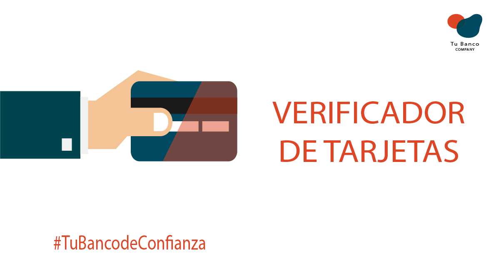

👩‍💻Proyecto Tarjeta de crédito válida👩‍💻

El proyecto se trata de una página segura🔒 que te ayuda a validar una tarjeta de credito para poder realizar compras en línea🛒🛍️, el objetivo de la página es promocionar📢 a la entidad financiera "Tu Banco", el usuario al rellenar el formulario se muestra dos funciones: Validar la tarjeta, enmascarar los números expetuando los últimos 4.
La pagina cuenta con:
🔘El formulario que presenta campos a rellenar, con esto podremos ejecutar ambos metodos isValid y Maskify.
🔘Botton de Validar, este ayudara a verficar la informacion ingresada, donde si la tarjeta es Valido ✅se lanzara una alerta con el mensaje"Tarjeta Valida", en caso no es valido❌ se lanzara la alerta con el mensaje "Tarjeta Invalida"

